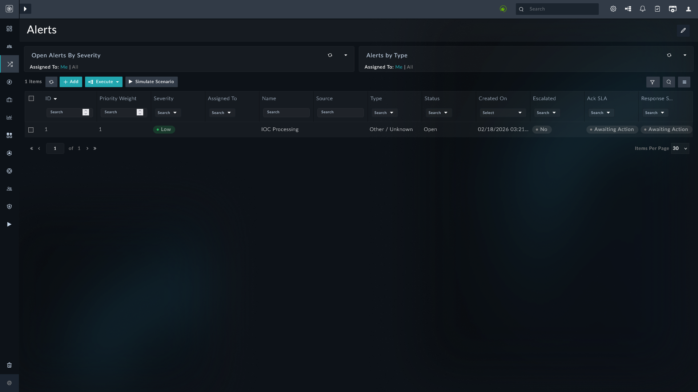
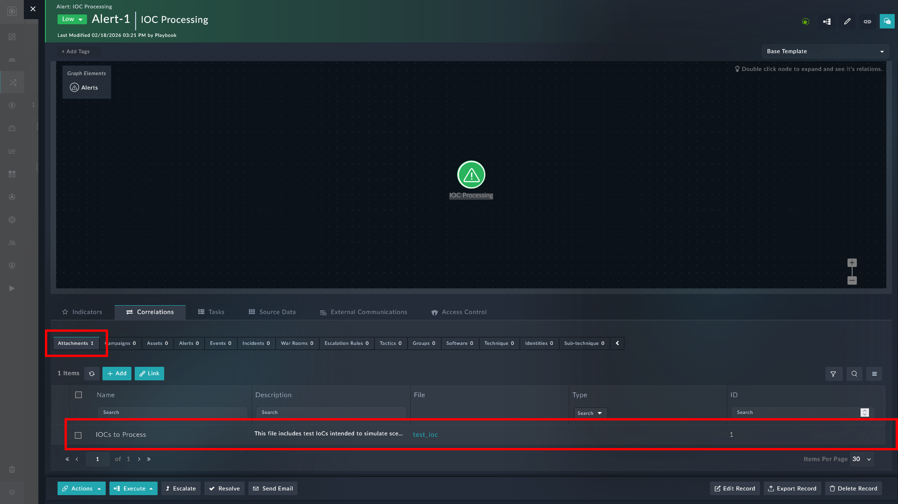
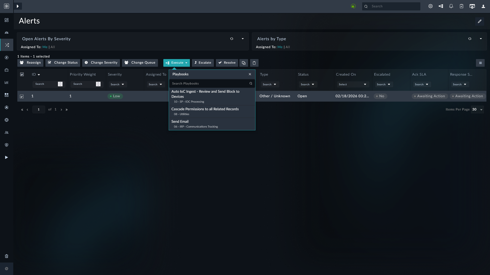
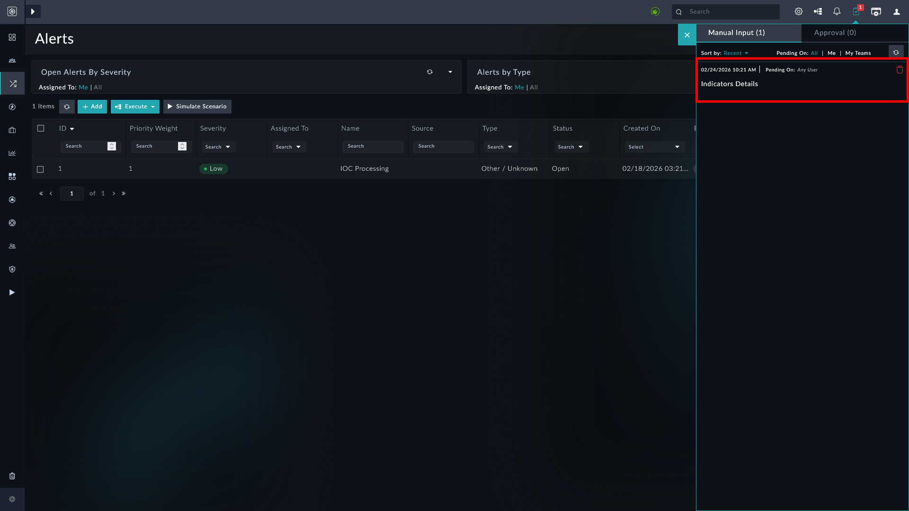
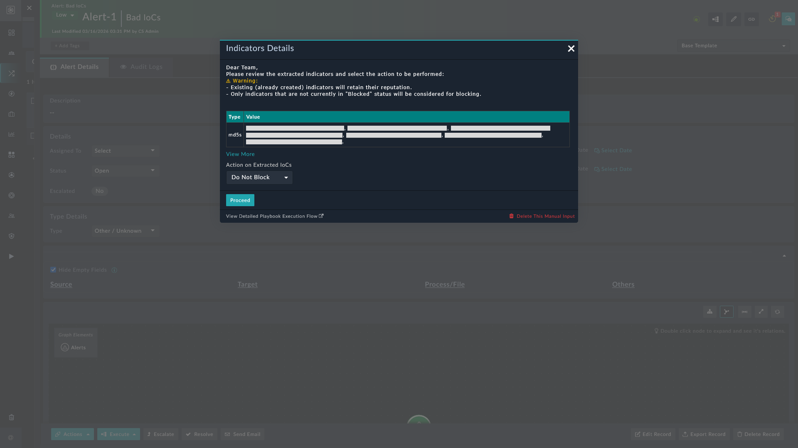
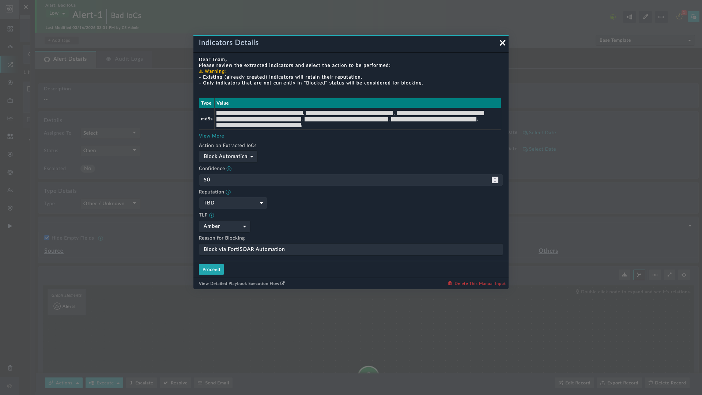
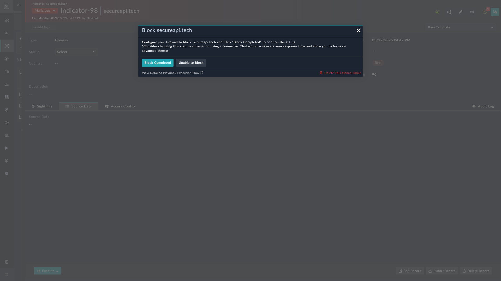
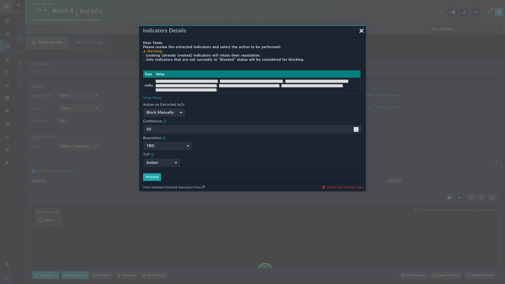

| [Home](../README.md) |
|----------------------|

# Usage

Refer to [Simulate Scenario documentation](https://github.com/fortinet-fortisoar/solution-pack-soc-simulator/blob/develop/docs/usage.md#simulate-a-scenario) to understand how to simulate and reset scenarios.

To understand the process FortiSOAR follows to respond to IOC processing and automation, this solution pack includes a scenario - **IOC Processing** - that demonstrates the end-to-end workflow for ingesting and extracting Indicators of Compromise (IOCs) from alert attachments.

## Scenario: IOC Processing Alert

This scenario generates an example alert of type **Other/Unknown**. 

Navigate to the demo alert and note the following:

- The demo alert created is an example of an email ingestion using the Exchange connector's alert ingestion feature.

    

- Alert is linked to attachments which has sample IOCs.

    

- Select the alert record and click the button **Execute**.

    

    Alternatively, you can select the alert to open its detailed view and click **Execute** from bottom left.

- From the drop-down, select the playbook **Auto IoC Ingest - Review and Send Block to Devices**.

- Click the icon **Pending Tasks** <picture><source media="(prefers-color-scheme: dark)" srcset="./res/icon-taskpad-light.svg"><source media="(prefers-color-scheme: light)" srcset="./res/icon-taskpad-dark.svg"></picture> to see a notification of a manual input.

    

- Click the notification to open the manual input with the details of the IoCs extracted.

    

    On the manual input, users have the following actions available:
    - Block Automatically
    - Block Manually
    - Do Not Block

>[!Important]
>For existing IoC records:
>- Only the *Expires On*, *Confidence*, and *Last Seen* fields are updated; the reputation remains unchanged
>- If the status of the IoCs is not *Blocked*, only then the IoCs are considered for blocking.

### Block Automatically

Creates indicator records, marks their status as **Blocked**, and prompts for metadata (*Confidence*, *TLP*, *Reputation*).

Clicking **Proceed** triggers the following actions:

- Creates IoC records under the module **Indicators** with *Confidence*, *TLP*, *Reputation*, and *Reason for Blocking* as specified in the manual input.

- Sets the status of the indicator records to **Blocked**.

- For *each* indicator record created, a manual input like the following, asks users to confirm that the indicator has been blocked.

    

### Block Manually

Creates indicator records *without modifying the status*, and prompts for metadata (*Confidence*, *TLP*, *Reputation*).

Clicking **Proceed** triggers the following actions:

- Creates IoC records under the module **Indicators** with *Confidence*, *TLP*, and *Reputation* as specified in the manual input.

- Allows users to review and update the status of the indicator records later

### Do Not Block

No action is taken on the extracted indicators

## Next Steps

| [Installation](./setup.md#installation) | [Configuration](./setup.md#configuration) | [Contents](./docs/contents.md) |
|-----------------------------------------|-------------------------------------------|--------------------------------|
